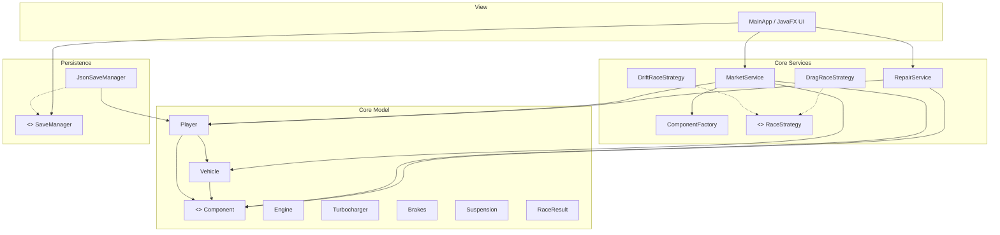

# Wiki del Progetto: Midnight Garage

Benvenuti nella Wiki di **Midnight Garage**, un gioco di ruolo (RPG) gestionale e di simulazione automobilistica sviluppato come progetto per il corso di *Metodologie di Programmazione e Modellazione e Gestione della Conoscenza* (A.A. 2025/2026).

---

## 1. Funzionalità Implementate

Midnight Garage simula la gestione di un'officina automobilistica e le corse clandestine. Le funzionalità incluse nella prima release sono:
* **Garage (Gestione Officina):** Visualizzazione dei veicoli posseduti. Per il veicolo attivo, viene mostrata una tabella con lo stato di usura (`condition` da 0% a 100%) di ciascun componente equipaggiato e il bonus prestazionale effettivo. I componenti possono essere riparati pagando in contanti o smontati e rimessi in inventario.
* **Mercato Nero (Shop):** Generazione giornaliera/dinamica di nuove offerte di auto usate e componenti (con tre livelli di rarità: Rusty, OEM, Racing). Consente anche la vendita di componenti inutilizzati (al 50% del valore originario) o di intere auto (al 75% del valore stimato).
* **Corse Clandestine (Race Simulator):** Simulazione di corse clandestine con due modalità:
  1. *Drag Race (Accelerazione):* Vince chi ha la potenza motore più elevata (somma di `Engine` e `Turbocharger`).
  2. *Touge Drift (Derapata):* Dipende da assetto (`Suspension`), stabilità (`Brakes`) e livello del pilota.
  *Durante le corse, i componenti subiscono usura reale proporzionale.*
* **Persistenza (Salvataggio & Caricamento):** Possibilità di salvare e riprendere la sessione corrente. Lo stato del gioco viene serializzato in formato JSON e memorizzato in `savegame.json`.

---

## 2. Architettura del Sistema

Il sistema segue l'architettura **MVC (Model-View-Controller)** per separare nettamente la logica di business dall'interfaccia grafica:

---

## 3. Classi ed Interfacce Sviluppate (Responsabilità)

### Package `core.model`

*   **`Player`**: Custodisce lo stato globale del giocatore, inclusi il saldo in contanti (`cash`), i punti reputazione (`reputation`), le auto possedute (`vehicles`) e l'inventario dei pezzi di ricambio (`inventory`). Gestisce l'aggiunta/sottrazione di fondi e XP ed espone eccezioni se i fondi sono insufficienti.
*   **`Vehicle`**: Rappresenta un'auto da corsa. Ha la responsabilità di mantenere i dati identificativi (modello, anno di fabbricazione, valore base) e la mappa dei componenti installati. Fornisce calcoli derivati come la condizione media del veicolo, il valore stimato corrente e il punteggio complessivo delle prestazioni.
*   **`Component` (Classe Astratta)**: Modella un generico pezzo meccanico. Conserva attributi come nome, condizione di usura (0.0 - 1.0) e bonus prestazionale base. Espone il metodo `getEffectiveBonus()` che calcola l'apporto prestazionale scalato sulla condizione corrente.
*   **`Engine`, `Turbocharger`, `Brakes`, `Suspension`**: Classi concrete che ereditano da `Component` per tipizzare i diversi pezzi del veicolo in conformità con l'Open/Closed Principle.
*   **`RaceResult`**: Data carrier che raccoglie l'esito di una simulazione di corsa (vittoria/sconfitta, log narrativo, contanti e reputazione vinti).

### Package `core.service`

*   **`ComponentFactory`**: Factory Pattern. Incapsula la logica di creazione dei componenti pre-configurandoli come "Rusty" (bassa condizione, basso bonus), "OEM" (condizione media) o "Racing" (alta condizione, alto bonus) senza esporre i dettagli costruttivi alla View.
*   **`RepairService`**: Service Layer. Implementa la logica e le formule economiche per la riparazione dei pezzi (prezzo proporzionale a usura e prestazioni base). Applica la riparazione modificando la condizione del pezzo e scala il denaro dal Player assegnandogli punti esperienza.
*   **`MarketService`**: Gestisce il negozio quotidiano di auto e pezzi. Fornisce metodi per acquistare, vendere e rigenerare le merci disponibili basandosi sul livello del giocatore.
*   **`RaceStrategy` (Interfaccia)**: Dichiara i contratti per l'esecuzione di una corsa (`executeRace(Vehicle)`).
*   **`DragRaceStrategy` / `DriftRaceStrategy`**: Implementazioni del pattern Strategy. Eseguono simulazioni fisiche/narrative diverse, calcolano il punteggio dell'auto basandosi sui componenti necessari, applicano usura ai pezzi coinvolti ed emettono un `RaceResult`.

### Package `persistence`

*   **`SaveManager<T>` (Interfaccia)**: Astrazione della persistenza. Definisce i metodi `save(T, File)` e `load(File)`.
*   **`JsonSaveManager`**: Implementa `SaveManager<Player>` serializzando lo stato in formato JSON tramite la libreria Google Gson.
*   **`ComponentAdapter`**: Custom JSON Serializer/Deserializer registrato su Gson. Consente la corretta serializzazione e ricostruzione polimorfica delle sottoclassi concrete di `Component` (evitando stack overflow ricorsivi).

### Package `view`

*   **`MainApp`**: Entry point di JavaFX. Gestisce l'inizializzazione del ciclo di vita dell'applicazione, la visualizzazione dei tre pannelli (TabPane), il data binding e gli aggiornamenti reattivi dell'interfaccia utente (es. effetto macchina da scrivere per la simulazione della gara).

---

## 4. Organizzazione dei Dati e Persistenza

La persistenza è organizzata salvando l'intera sessione di gioco del `Player` (comprese le vetture con tutti i componenti installati e l'inventario dei pezzi sfusi) in un unico file JSON (`savegame.json`).

Per garantire l'estendibilità e rispettare il **DIP (Dependency Inversion Principle)**:
1. La UI interagisce esclusivamente con l'interfaccia `SaveManager<Player>`.
2. Se in futuro si desidera migrare su un database SQLite o in Cloud:
   - Sarà sufficiente implementare un `SqliteSaveManager` o `CloudSaveManager` che realizza `SaveManager<Player>`.
   - La logica del controller e dei moduli core rimarrà al 100% intatta, richiedendo solo di modificare l'istanziazione iniziale nel `MainApp.java`.

---

## 5. Meccanismi di Estendibilità (Nuove Funzionalità)

L'architettura è stata progettata per facilitare future estensioni su più fronti:

### A. Aggiungere un Nuovo Componente
1. Aggiungere il nuovo tipo all'enum `ComponentType` (es. `TIRES`).
2. Creare una classe concreta `Tires` che estende `Component`.
3. Aggiornare `ComponentFactory` per includere la generazione di componenti di tipo `TIRES` nei metodi `createRustyComponent`, `createOEMComponent` e `createRacingComponent`.
*Nessun'altra parte della logica di simulazione delle gare esistenti o del motore di salvataggio subirà modifiche.*

### B. Aggiungere un Nuovo Tipo di Gara (Strategy Pattern)
1. Creare una nuova classe (es. `RallyRaceStrategy`) che implementa l'interfaccia `RaceStrategy`.
2. Definire la propria logica di calcolo dei punteggi (es. basata su `Suspension` e `Engine`) e narrative log nel metodo `executeRace(Vehicle)`.
3. Aggiungere un'istanza della nuova strategia alla lista di gare disponibili nel controller UI (`MainApp.java`).
*Le gare esistenti e le vetture non necessitano di alcuna modifica strutturale.*

### C. Cambiare l'Interfaccia Utente (View)
La logica del `core` è completamente disaccoppiata dalle librerie JavaFX. Se si decidesse di portare l'applicazione su Web o in modalità a riga di comando (CLI):
* Si può eliminare del tutto il package `view`.
* I moduli `core` e `persistence` possono essere inseriti in un progetto Spring Boot o Android senza alcuna modifica, in quanto contengono puro codice Java Standard.

---

## 6. Utilizzo di strumenti AI

Durante la realizzazione di questo progetto ho utilizzato il modello `Gemini Flash 3.5` attraverso l'agent `Antigravity`.

Questo strumento mi ha aiutato nei seguenti punti:
* Implementazione dei vari tipi di componenti
  * Non avendo avuto tempo di dedicarmi in maniera approfondita alla ricerca e all'inserimento di componenti dettagliati per questo tipo di macchine, ho lasciato inserire all'agente alcuni nomi generici (e generare parte dello switch/case copiando il mio template iniziale).
  * Successivamente al passaggio dell'agente, ho modificato i nomi di alcuni motori e turbine, per inserirne altri di mio gradimento (Vedi motori `4G63T`, `2JZ GTE`, turbine `Garrett`, macchina `Eclipse`...).
* Generazione documentazione di base
  * `README.md` e `WIKI.md` sono basati su dei file markdown generati dal fido Gemini
  * Non avendo molte idee su cosa inserire al di fuori del funzionamento di base, l'ho usato come spunto per proseguire la doc.
* Idee per UI
  * L'interfaccia grafica iniziale era piuttosto pietosa, ho chiesto come poterla migliorare e mi ha suggerito il tema scuro e i colori "neon".
* Code review
  * Finito il progetto, l'ho fatto leggere dall'agente, che mi ha suggerito di aggiungere dei guard statement che mi ero scordato in `service/MarketService`